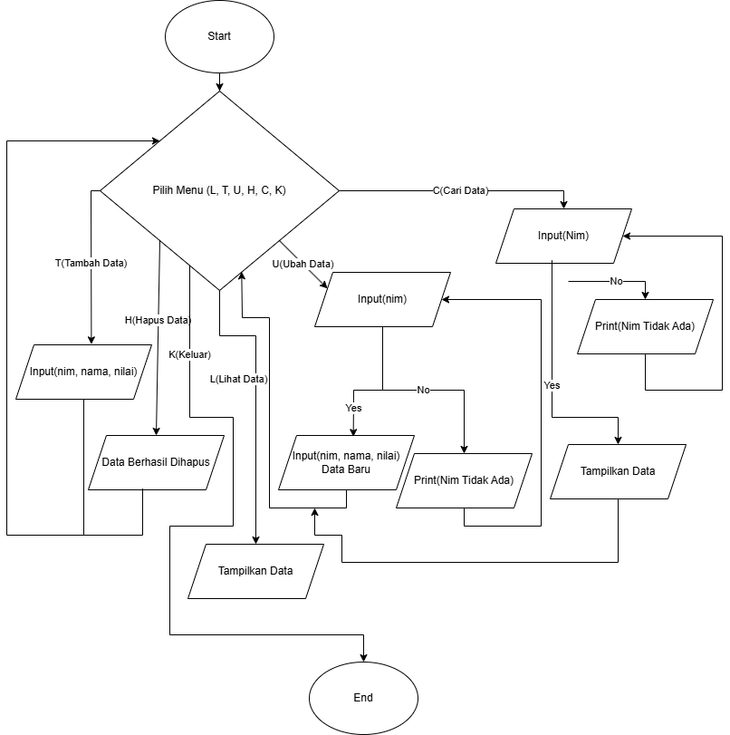

# Membuat Daftar Mahasiswa Menggunakan Dictonary 
# Codingan 
```

data_mahasiswa = {}

def lihat_data():
    if not data_mahasiswa:
        print("Daftar Nilai")
        print("=" * 81)
        print(f"{'No'.center(5)}|{'Nama'.center(15)}|{'NIM'.center(10)}|{'Nilai Tugas'.center(13)}|{'Nilai UTS'.center(10)}|{'Nilai UAS'.center(10)}|{'Nilai Akhir'.center(10)}|")
        print("=" * 81)
        print(f"{'TIDAK ADA DATA'.center(75)}")A
        print("=" * 81)
        return
    print("Daftar Nilai")
    print("=" * 81)
    print(f"{'No'.center(5)}|{'Nama'.center(15)}|{'NIM'.center(10)}|{'Nilai Tugas'.center(13)}|{'Nilai UTS'.center(10)}|{'Nilai UAS'.center(10)}|{'Nilai Akhir'.center(10)}|")
    print("=" * 81)
    for i, (nim, mhs) in enumerate(data_mahasiswa.items(), start=1):
        print(f"{str(i).center(5)}|{mhs['nama'].ljust(15)}|{nim.center(10)}|{str(mhs['tugas']).center(13)}|{str(mhs['uts']).center(10)}|{str(mhs['uas']).center(10)}|{format(mhs['nilai_akhir'], '.2f').center(10)} |")
    print("=" * 81)

def tambah_data():
    print("Tambah Data")
    nim = input("NIM: ")
    if nim in data_mahasiswa:
        print("Data dengan NIM tersebut sudah ada!")
        return
    nama = input("Nama: ")
    tugas = float(input("Nilai Tugas: "))
    uts = float(input("Nilai UTS: "))
    uas = float(input("Nilai UAS: "))
    nilai_akhir = (tugas * 0.3) + (uts * 0.35) + (uas * 0.35)

    data_mahasiswa[nim] = {
        "nama": nama,
        "tugas": tugas,
        "uts": uts,
        "uas": uas,
        "nilai_akhir": nilai_akhir
    }
    print("Data berhasil ditambahkan!")

def ubah_data():
    lihat_data()
    if not data_mahasiswa:
        return
    
    nim = input("Masukkan NIM data yang akan diubah: ")
    if nim in data_mahasiswa:
        print("Masukkan Data Baru")
        nama = input("Nama: ")
        tugas = float(input("Nilai Tugas: "))
        uts = float(input("Nilai UTS: "))
        uas = float(input("Nilai UAS: "))
        nilai_akhir = (tugas * 0.3) + (uts * 0.35) + (uas * 0.35)

        data_mahasiswa[nim] = {
            "nama": nama,
            "tugas": tugas,
            "uts": uts,
            "uas": uas,
            "nilai_akhir": nilai_akhir
        }
        print("Data berhasil diubah!")
    else:
        print("NIM tidak ditemukan!")

def hapus_data():
    lihat_data()
    if not data_mahasiswa:
        return

    nim = input("Masukkan NIM data yang akan dihapus: ")
    if nim in data_mahasiswa:
        del data_mahasiswa[nim]
        print("Data berhasil dihapus!")
    else:
        print("NIM tidak ditemukan!")

def cari_data():
    keyword = input("Masukkan nama atau NIM yang ingin dicari: ")
    hasil_cari = {nim: mhs for nim, mhs in data_mahasiswa.items() if keyword.lower() in mhs['nama'].lower() or keyword in nim}
    
    if hasil_cari:
        print("Hasil Pencarian:")
        print("=" * 81)
        print(f"{'No'.center(5)}|{'Nama'.center(15)}|{'NIM'.center(10)}|{'Nilai Tugas'.center(13)}|{'Nilai UTS'.center(10)}|{'Nilai UAS'.center(10)}|{'Nilai Akhir'.center(10)}|")
        print("=" * 81)
        for i, (nim, mhs) in enumerate(hasil_cari.items(), start=1):
            print(f"{str(i).center(5)}|{mhs['nama'].ljust(15)}|{nim.center(10)}|{str(mhs['tugas']).center(13)}|{str(mhs['uts']).center(10)}|{str(mhs['uas']).center(10)}|{format(mhs['nilai_akhir'], '.2f').center(10)}|")
        print("=" * 81)
    else:
        print("Data tidak ditemukan.")

while True:
    pilihan = input("[(L)ihat (T)ambah (U)bah (H)apus (C)ari (K)eluar] : ").lower()
    if pilihan == 't':
        tambah_data()
    elif pilihan == 'u':
        ubah_data()
    elif pilihan == 'h':
        hapus_data()
    elif pilihan == 'l':
        lihat_data()
    elif pilihan == 'c':
        cari_data()
    elif pilihan == 'k':
        print("Program selesai.")
        break
    else:
        print("Pilihan tidak valid!")
```

# Hasil Codingan 
```
[(L)ihat (T)ambah (U)bah (H)apus (C)ari (K)eluar] : t
Tambah Data
NIM: 080502
Nama: vito
Nilai Tugas: 90  
Nilai UTS: 90
Nilai UAS: 90
Data berhasil ditambahkan!
[(L)ihat (T)ambah (U)bah (H)apus (C)ari (K)eluar] : t
Tambah Data
NIM: 090603
Nama: nopal
Nilai Tugas: 50
Nilai UTS: 50
Nilai UAS: 50
Data berhasil ditambahkan!
[(L)ihat (T)ambah (U)bah (H)apus (C)ari (K)eluar] : u
Daftar Nilai
=================================================================================
  No |      Nama     |   NIM    | Nilai Tugas |Nilai UTS |Nilai UAS |Nilai Akhir|
=================================================================================
  1  |vito           |  080502  |     90.0    |   90.0   |   90.0   |  90.00    |
  2  |nopal          |  090603  |     50.0    |   50.0   |   50.0   |  50.00    |
=================================================================================
Masukkan NIM data yang akan diubah: 090603
Masukkan Data Baru
Nama: aldi
Nilai Tugas: 60
Nilai UTS: 60
Nilai UAS: 60
Data berhasil diubah!
[(L)ihat (T)ambah (U)bah (H)apus (C)ari (K)eluar] : l
Daftar Nilai
=================================================================================
  No |      Nama     |   NIM    | Nilai Tugas |Nilai UTS |Nilai UAS |Nilai Akhir|
=================================================================================
  1  |vito           |  080502  |     90.0    |   90.0   |   90.0   |  90.00    |
  2  |aldi           |  090603  |     60.0    |   60.0   |   60.0   |  60.00    |
=================================================================================
[(L)ihat (T)ambah (U)bah (H)apus (C)ari (K)eluar] : h
Daftar Nilai
=================================================================================
  No |      Nama     |   NIM    | Nilai Tugas |Nilai UTS |Nilai UAS |Nilai Akhir|
=================================================================================
  1  |vito           |  080502  |     90.0    |   90.0   |   90.0   |  90.00    |
  2  |aldi           |  090603  |     60.0    |   60.0   |   60.0   |  60.00    |
=================================================================================
Masukkan NIM data yang akan dihapus: 090603
Data berhasil dihapus!
[(L)ihat (T)ambah (U)bah (H)apus (C)ari (K)eluar] : c
Masukkan nama atau NIM yang ingin dicari: 080502
Hasil Pencarian:
=================================================================================
  No |      Nama     |   NIM    | Nilai Tugas |Nilai UTS |Nilai UAS |Nilai Akhir|
=================================================================================
  1  |vito           |  080502  |     90.0    |   90.0   |   90.0   |  90.00   |
=================================================================================
[(L)ihat (T)ambah (U)bah (H)apus (C)ari (K)eluar] : l
Daftar Nilai
=================================================================================
  No |      Nama     |   NIM    | Nilai Tugas |Nilai UTS |Nilai UAS |Nilai Akhir|
=================================================================================
  1  |vito           |  080502  |     90.0    |   90.0   |   90.0   |  90.00    |
=================================================================================
[(L)ihat (T)ambah (U)bah (H)apus (C)ari (K)eluar] : k
Program selesai.
```

# Flowchart 


# Penjelasan
Dalam codingan di atas kita membuat codingan daftar mahsiswa menggunkan Dictonary. Dalam codingan di atas terdapat beberapa fungsi yaitu:
- Fungsi hitung_nilai_akhir
    ```
    def hitung_nilai_akhir(tugas, uts, uas):
    return (tugas * 0.30) + (uts * 0.35) + (uas * 0.35)
    ```
    Fungsi : Menghitung nilai akhir mahasiswa
  
- Fungsi tambah_data    
    ```
    def tambah_data(data):
        ...
    ```
    
    Tujuan: Menambahkan data mahasiswa ke dalam dictionary data.

- Fungsi ubah_data
    ```
    def ubah_data(data):
        ...
    ```
    
    Tujuan: Mengubah data mahasiswa yang sudah ada.

- Fungsi hapus_data
    ```
    def hapus_data(data):
        ...
    ```
    Tujuan: Menghapus data mahasiswa berdasarkan nim.

- Fungsi tampilkan_data
    ```
    def tampilkan_data(data):
        ...
    ```
    Tujuan: Menampilkan semua data mahasiswa yang ada.

- Fungsi cari_data
    ```
    def cari_data(data):
        ...
    ```
    Tujuan: Mencari data mahasiswa berdasarkan nama.

berikut adalah penjelasan dari fungsi-fungsi di atas.
